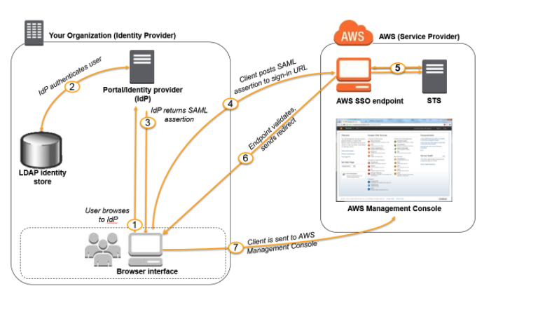

# RH-SSO integration with AWS
## Introduction
The following diagram illustrates the flow for [SAML-enabled flow](#useful-links)[1]:
.

In AWS, only IdP-initiated SAML flow is supported, which means user needs to be provided with the URL from the IdP to access the Single Signon page for AWS.

The scripts for AWS is fully automated, which creates and configures the client on Keycloak, and set up on AWS IAM.

## Prerequisites
- Working RH-SSO instance
- Working Ansible Controller instance
- Administrator access for Ansible and RH-SSO
- [Environment Variables](../README.md#integration-with-rhsso-environment-variables) from `argocd-configs` Config Map and `sso-configs` Secret.

## Automation
* **Step 1: Create an image for deploying client**
    * Create an image using file [config-aws.sh](../config-aws.py).  A complete list of environment variables can be found at [Integration with RHSSO Environment Variables](https://github.com/otp-demo/rhsso-auto#integration-with-rhsso-environment-variables).
* **Step 2: Run script to create an image and run from a Dockerfile**
 * After you are satisfied with variables, payload information etc. in [create-client-aws.py](../create-client-aws.py) and [update-keycloak-aws-configs.py](../update-keycloak-aws-configs.py) files, you can use a script [config-aws.sh](../config-aws.sh) to run .py and create a Dockerfile that that installs [requirements](../requirements.txt) and runs [config-aws.sh](../config-aws.sh). For testing, you can also run it locally by setting local environment variables or storing them in .env file.
    * **Run locally**
      ```bash
      python3 create-client-aws.py 
      python3 update-keycloak-aws-configs.py.py 
      ```
    * **Build as an image**
      Navigate to the root directory of this project and build the image using docker or podman and run the following command. Update repository name and image name as required in build and push commands.
      
      ```bash
        docker build -t quay.io/leoliu2011/aws-keycloak-integration:v1 -f Dockerfile-aws .
        docker push quay.io/leoliu2011/aws-keycloak-integration:v1
      ```

* **Step 3: Running in Kubernetes or OpenShift**
  This script is designed to be ran as a Job in a Kubernetes-like environment. This Job will run a container containing this script once using the environment variables provided to it. You will likely need to push an image of this script with your payload attributes to a container registry that your cluster can reach. It is recommended that you get the admin username and password from a Secret or similarly secure resource.

    **Example Job**
    ```yaml
    apiVersion: batch/v1
    kind: Job
    metadata:
    name: aws-keycloak-integration
    namespace: sso-integration
    spec:
    template:
        spec:
        containers:
        - name: aws-keycloak-integration
            image: quay.io/leoliu2011/aws-keycloak-integration:v1
            imagePullPolicy: Always
            envFrom:
            - configMapRef:
                name: argocd-configs
            - secretRef:
                name: sso-configs
        restartPolicy: Never
    backoffLimit: 5
    ```

## Manual Configuration
The example manual configuraiton can be found on the [post](https://neuw.medium.com/aws-connect-saml-based-identity-provider-using-keycloak-9b3e6d0111e6) - [2](#useful-links)

## Useful links
1. [Enabling SAML 2.0 federated users to access the AWS Management Console](https://docs.aws.amazon.com/IAM/latest/UserGuide/id_roles_providers_enable-console-saml.html)
2. [AWS SAML based User Federation using Keycloak](https://neuw.medium.com/aws-connect-saml-based-identity-provider-using-keycloak-9b3e6d0111e6)
3. [Troubleshooting SAML on AWS](https://docs.aws.amazon.com/IAM/latest/UserGuide/troubleshoot_saml.html)